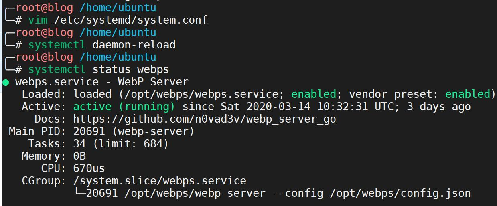

## 小插曲

最近和 [土豆哥](https://www.bennythink.com/) 在捣鼓 [Webp Server Go](https://github.com/webp-sh/webp_server_go) 的时候发咱一张 `systemctl status webp` 的信息：


咦？咱的 `systemctl status webp` 为啥子没得 CPU 和 Memory 信息呐？


然后和土豆哥请教了一下，咱也想要。于是土豆哥发咱一篇 [systemd – systemctl 不显示内存 CPU 信息](https://www.bennythink.com/systemd-accounting.html) 博客，于是拜师学艺就 get 到啦😋。只需要在 systemd 的配置文件中 `/etc/systemd/system.conf` 追加

```ini
DefaultCPUAccounting=yes
DefaultMemoryAccounting=yes
DefaultTasksAccounting=yes
```

然后再 `systemctl daemon-reload` 一把梭就可以啦。



不过，咱还是要深入地学习一下 `systemd` ，于是就水了这篇博客😂

## Linux 启动流程
