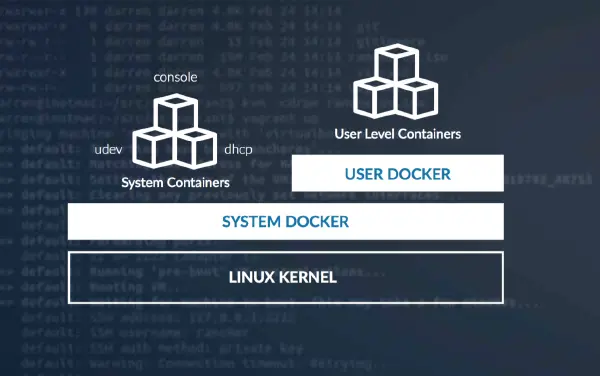
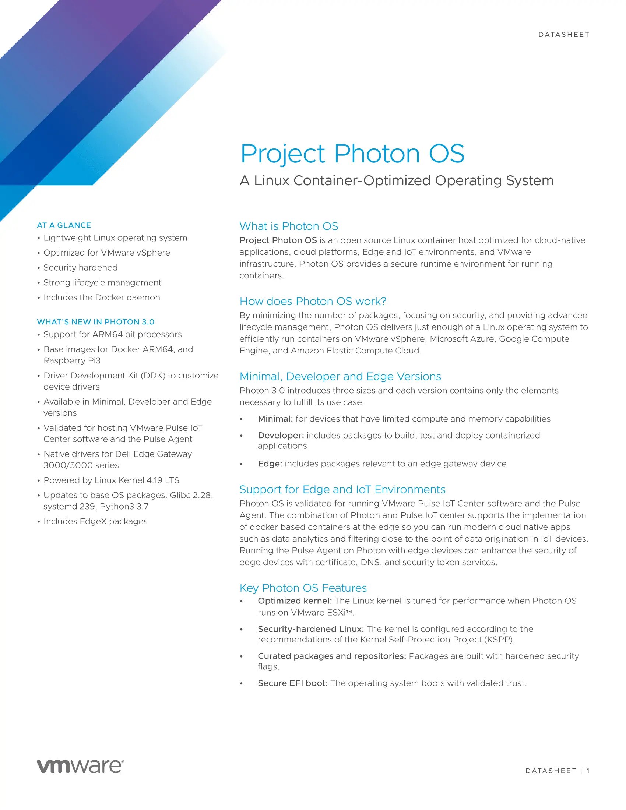
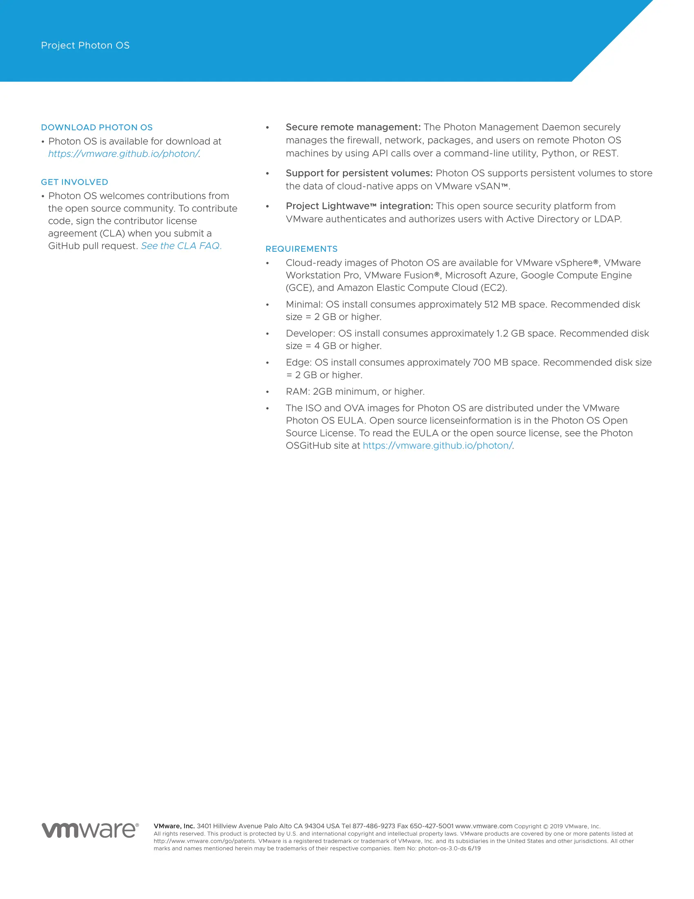

前段时间捡垃圾东拼西凑搞了台 Homelab 👇玩玩 👉[《垃圾佬的 Homelab 折腾记录》](https://blog.k8s.li/homelab.html) 。


总体来讲性价比高，Intel i5-6600T 的性能和 i5-6600 持平，比那种 8250U 之类的低压 U 要高很多，跑一堆虚拟机也不成问题，甚至跑个三 master + 两 node 的 kubernetes 集群也是可以😂。至于功耗，整机待机时不到 30W ，一天不到 1 度电，不用担心电费爆表了；至于价格，一颗 Intel i5-6600T  不到 450 块钱，还不香嘛🙃。

在 ESXi 运行着一些虚拟机，比如用 WireGuard 打通 VPS 之间的网络，运行在一个 alpine 虚拟机里作为网关机使用；比如使用 [Pi-hole®](https://pi-hole.net/) 来构建自己的 DNS 服务器，用来拦截屏蔽域名；比如运行 time-machine 服务用来定时备份 MacBook ；比如 Windows 虚拟机里运行着一些国产毒瘤软件😡；比如使用 [Drone](https://docs.drone.io/) 跑一套轻量级的 CI 流水线系统，总之可玩性非常高哦，只要你又时间瞎折腾，总能找点乐子玩😂。

## Linux container OS ?

有了一台运行着 ESXi 的 Homelab ，今天就玩一下 Linux container OS ，即 Linux 容器  OS 、容器优化型 OS，这是一类专门针对运行容器定制化开发的 Linux 发行版，裁剪掉一些不必要的软件和内核模块，使系统更加轻量一些。虽然来说民用级的 Intel i5-6600T 性能也不算太差，但和 E3  小王子，E5 老大哥比还是差个十万八千里。因此为了节省一些 CPU 资源，减少虚拟化带来的开销，就选择了容器化运行一些应用，同时再为容器找一个轻量级的宿主机 OS ，这就是为什么想要使用 Linux container OS 的原因。

### GKE 的 [Container-Optimized OS](https://cloud.google.com/container-optimized-os/docs/)

Kubernetes 的亲爸爸 Google 家的 [Google Kubernetes Engine](https://cloud.google.com/kubernetes-engine) 即 GKE 集群中的每个节点都是使用 [Container-Optimized OS](https://cloud.google.com/container-optimized-os/docs/) 来运行工作负载，不过仅仅是针对 GCE 来进行优化的，可能在 OpenStack 或者 vSphere 上运行不起来，(瞎猜😂。

>   Container-Optimized OS 是适用于 [Compute Engine](https://cloud.google.com/compute) 虚拟机的操作系统映像，专为运行 Docker 容器而优化。借助 Container-Optimized OS，您可以快速、高效、安全地在 Google Cloud Platform 上启动 Docker 容器。Container-Optimized OS 由 Google 维护，基于 [Chromium OS](https://www.chromium.org/chromium-os) 开放源代码项目。

特点就是不同于其他的 Linux 发行版，这个是基于 [Chromium OS](https://www.chromium.org/chromium-os) 定制化开发的，对内核版本选用的也比较激进，一般是 `4.19.112+` 或者 `5.x` 版本，这样你就不用再担心像 CentOS 7.x 系列那样各种内核 bug 了😂。

```yaml
apiVersion: v1
items:
- apiVersion: v1
  kind: Node
  metadata:
    nodeInfo:
      architecture: amd64
      bootID: 0c517083-aaf6-75fc4b2204ba
      containerRuntimeVersion: docker://19.3.1
      kernelVersion: 4.19.112+
      kubeProxyVersion: v1.16.13-gke.1
      kubeletVersion: v1.16.13-gke.1
      machineID: 33a96ff3203d88c0a542
      operatingSystem: linux
      osImage: Container-Optimized OS from Google
      systemUUID: 33a96ff33d88c0a542
```

Chromium OS 就是 Google 基于 Linux 内核开发的操作系统，所以 Google 也有这个实力针对自家的 GCP 云平台进行定制化开发个 OS 出来，专门给 kubernetes 集群运行使用，定制化开发的好处就是可以带来更多的新特性，二不受制于上游的 Linux 发行版的限制。比如不久前 Google 宣布将使用 [Cilium](https://cilium.io/) 作为 GKE 的下一代数据面，[New GKE Dataplane V2 increases security and visibility for containers](https://cloud.google.com/blog/products/containers-kubernetes/bringing-ebpf-and-cilium-to-google-kubernetes-engine) ，而 Cilium 这项技术是依赖于对 eBPF 技术，而 eBPF 又依赖于内核特性的支持。

### AWS 的 [Bottlerocket OS](https://github.com/bottlerocket-os/bottlerocket)

这个是 AWS 最近开源专门针对  EC2 进行优化的 Linux container OS，和 GKE 一样，只是针对于自家的 AWS 公有云，由于是最近刚刚推出的，还没来得及关注，所以就不介绍了。

>   ### Optimized performance through AWS integrations
>
>   AWS provided builds of Bottlerocket are optimized to run on Amazon EC2 and include support for the latest Amazon EC2 instance capabilities. They also have built-in integrations with AWS services for container orchestration, registries, and observability.

### CoreOS Container Linux

来自 个人认为 CoreOS 的 CoreOS Container Linux 要比 Container-Optimized OS 和 Photon OS 要更加专业，尤其是针对容器来讲， CoreOS 就是专门用来运行容器的，它没有像 yum 或 apt 这样的包管理器来安装软件，在 CoreOS 中你不需要安装软件，因为所有的应用程序都要使用 docker 来打包。

>   额外提一句，，而 Red Hat® 已经被 IBM 收购了，按照关系来讲而 CoreOS 应该是 IBM 的孙子吧🙃。而 CoreOS Container Linux 仅仅是他们维护项目的其中一个，CoreOS 开源的项目还有：
>
>   -   etcd：
>   -   Clair:
>   -   dex：
>   -   Prometheus：
>   -   flannel：

在 Linux 世界里有大量的发行版可以做为服务器系统使用，但是这些系统大多部署复杂,，更新系统更是困难重重. 这些都是 CoreOS 试图解决的问题。

-   最小化的操作系统： 占用内存很少，比典型的服务器版本 Linux 少占 40%的内存。
-   易于升级： CoreOS 采用双系统分区（主动分区/被动分区）设计而不是采用传统的通过升级包来升级系统，这使得每次升级更加快速，可靠和易于回滚。这一点有点像 Android 的 A/B 分区？
-   集成 Docker： CoreOS 默认集成 Docker 并作了很好的支持和优化，省去用户安装，配置，优化 Docker 的时间，极大地方便了用户。
-   易于集群化： CoreOS 本身提供了大型 Docker 容器集群的整体解决方案，通过内置的 fleet 工具在多台系统中部署容器并进行集群化管理。同时通过提供 Discovery Service，便于动态部署和管理集群，解决方案比较成熟。
-   自动化的大规模部署： CoreOS 自身提供的解决方案能够自动地大规模批量部署并操作系统，极大地减少用户工作量。
-   使用 systemd 做为系统服务管理工具，性能比较好，systemd 有现代化的日志功能，同时采用 socket 式与 D-Bus 总线式激活服务.

不过 CoreOS 已经 EOF 了，[Fedora CoreOS](https://getfedora.org/coreos/) 成为 CoreOS 的继任者：

>   As we've [previously announced](https://groups.google.com/d/msg/coreos-user/zgqkG88DS3U/PFP9yrKbAgAJ), [Fedora CoreOS](https://getfedora.org/coreos/) is the official successor to CoreOS Container Linux. Fedora CoreOS is a [new Fedora Edition](https://fedoramagazine.org/fedora-coreos-out-of-preview/) built specifically for running containerized workloads securely and at scale. It combines the provisioning tools and automatic update model of Container Linux with the packaging technology, OCI support, and SELinux security of Atomic Host. For more on the Fedora CoreOS philosophy, goals, and design, see the [announcement of the preview release](https://fedoramagazine.org/introducing-fedora-coreos/) and the [Fedora CoreOS documentation](https://docs.fedoraproject.org/en-US/fedora-coreos/).

### 红帽的 [RHCOS](https://docs.openshift.com/container-platform/4.1/architecture/architecture-rhcos.html)

来自红帽子家的 [Red Hat Enterprise Linux CoreOS (RHCOS)](https://docs.openshift.com/container-platform/4.1/architecture/architecture-rhcos.html)，是基于不过这个 OS 仅仅适用于它自家的 [OpenShift](https://docs.openshift.com/)，而且容器运行时仅支持 CRI-O。

>   At the moment, CRI-O is only available as a container engine within OpenShift Container Platform clusters.

因为 CoreOS 团队现如今已经被 Red Hat® 收购了，正如在 [OpenShift 文档](https://access.redhat.com/documentation/zh-cn/openshift_container_platform/4.2/html/architecture/architecture-rhcos) 中提到的： Red Hat Enterprise Linux CoreOS (RHCOS) 代表了下一代单用途容器操作系统技术。RHCOS 由创建了 Red Hat Enterprise Linux Atomic Host 和 CoreOS Container Linux 的同一开发团队打造，它将 Red Hat Enterprise Linux (RHEL) 的质量标准与 Container Linux 的自动化远程升级功能结合在一起。

### CoreOS 的接盘侠 Flatcar Linux🤣

因为 CoreOS 团队被 Red Hat® 收购之后就忙着去搞 RHCOS 了，

### RancherOS

RancherOS 是 Rancher 团队所维护的开源项目，也是对标 CoreOS 一样，专门用来运行容器，并且可以运行在生产环境（至少官方做了这么样的承诺，咱也没在生产用过，不好说。在 RancherOS 中所有的进程（包括系统所有的服务，比如 udev 和 syslog）都是用 docker 来管理，这一点要比 CoreOS 更加激进一些，而 CoreOS 还是使用传统 Linux 发行版中的 systemd 来管理系统中的服务。RancherOS 通过移除传统 Linux 发行版中不必要的服务和库来最小化系统，使他专注单一的功能，即运行 docker 容器。不过之前体验了一番，占用资源比较多😂，好像并没有太大的优势（

`Everything in RancherOS is a Docker container.` 感觉这个要比 CoreOS 更加容器化，甚至使用 docker 取代了 systemd 来管理系统的各种服务。系统启动后运行两个 docker 服务进程，一个是系统 docker ，在此之上在运行系统服务容器，和用户层面的 docker 。不过看一下下面的这张图你就会明白。总的来讲 RancherOS 是使用 docker 来管理整个系统的服务的，包括用户层面的 docker 。



### VMware 的 [Photon OS](https://vmware.github.io/photon/)

今天的主角，VMware  开源的 Photon OS，这个 OS 你可能没听说过，但 VMware 开源的 Harbor 想必很熟悉，而 Harbor 的基础镜像使用的就是他家的 Photon OS😂。

```ini
root [ /harbor ]# cat /etc/os-release
NAME="VMware Photon OS"
VERSION="2.0"
ID=photon
VERSION_ID=2.0
PRETTY_NAME="VMware Photon OS/Linux"
ANSI_COLOR="1;34"
HOME_URL="https://vmware.github.io/photon/"
BUG_REPORT_URL="https://github.com/vmware/photon/issues"
```

在 Photon OS 的构建脚本 [build.py](https://github.com/vmware/photon/blob/master/build.py) 中可以看到它构建的产物支持 ISO 和 docker 镜像，以及众多公有云的虚拟机格式，两者都是来自相同的源码，根据构建出来的是形式不同，所包含的软件也不同。因为裁剪掉了一些不必要的系统服务， docker 镜像格式的要更精简一些。

```json
targetList = {
        "image":["iso", "ami", "gce", "azure", "rpi3", "ova", "ova_uefi", "all", "src-iso",
                "photon-docker-image", "k8s-docker-images", "all-images", "minimal-iso", "rt-iso"],

        "rpmBuild": ["packages", "packages-minimal", "packages-initrd", "packages-docker",
                "updated-packages", "tool-chain-stage1", "tool-chain-stage2", "check",
                "ostree-repo", "generate-yaml-files", "create-repo", "distributed-build"],

        "buildEnvironment": ["packages-cached", "sources", "sources-cached", "publish-rpms",
                "publish-x-rpms", "publish-rpms-cached", "publish-x-rpms-cached", "photon-stage"]
```

总的来讲，上面提到的几种容器优化型 OS 中 ，Photon OS 比较开放一些，虽然来说是针对于自家 vSphere 进行优化的，但其他公有云和私有云也是支持，甚至还支持树莓派🍓！所以个人用户想拿来玩玩，还是不错滴。尤其是针对咱这种玩 ESXi 软路由的垃圾佬，在 Photon OS 上跑一些容器应用，再适合不过了。






## 安装

### OVA

### ISO

### 公有云

### 树莓派！

你吃灰的树莓派又有用途啦，Photon OS 也支持树莓派😂。

## 系统概况

### systemd 大法好！

### 内存占用

### 磁盘占用

### 进程

## 网络管理

## 镜像源

## 运行容器

## 参考

-   [New GKE Dataplane V2 increases security and visibility for containers](https://cloud.google.com/blog/products/containers-kubernetes/bringing-ebpf-and-cilium-to-google-kubernetes-engine)
-   [被 Google 选择的下一代数据面 Cilium 是什么](https://moelove.info/2020/09/02/%E8%A2%AB-Google-%E9%80%89%E6%8B%A9%E7%9A%84%E4%B8%8B%E4%B8%80%E4%BB%A3%E6%95%B0%E6%8D%AE%E9%9D%A2-Cilium-%E6%98%AF%E4%BB%80%E4%B9%88/)